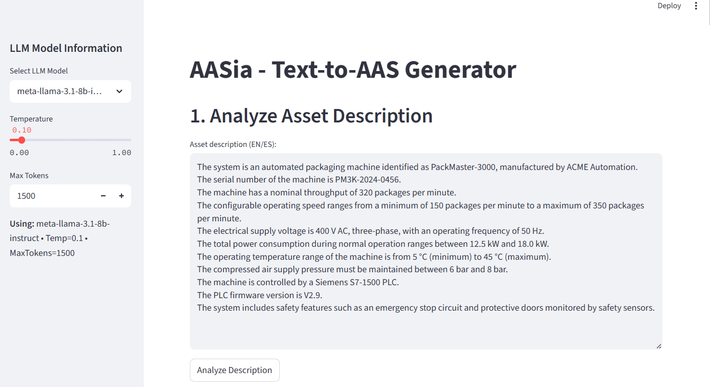
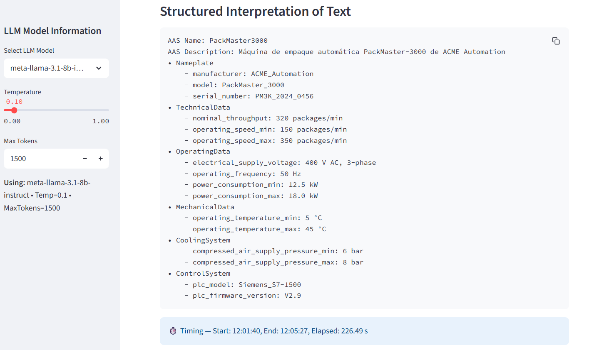
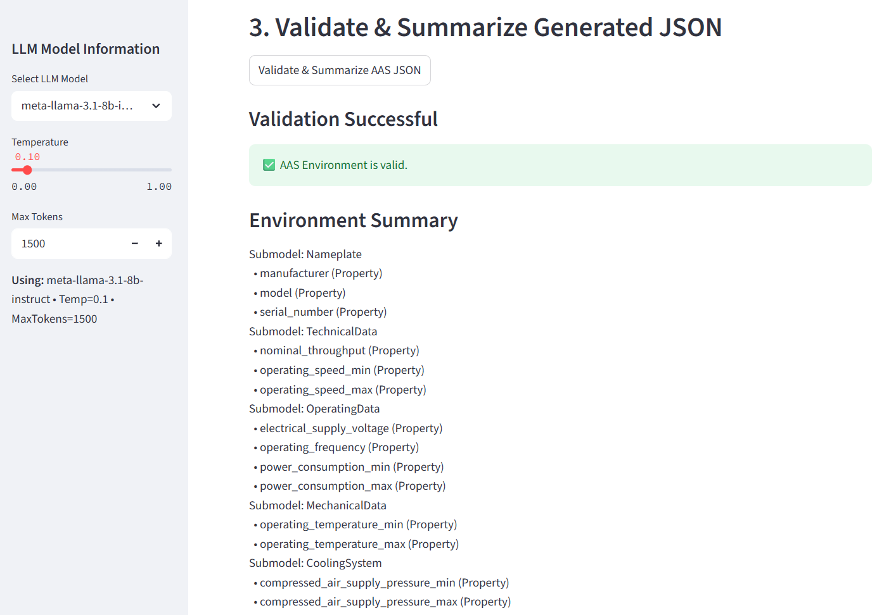
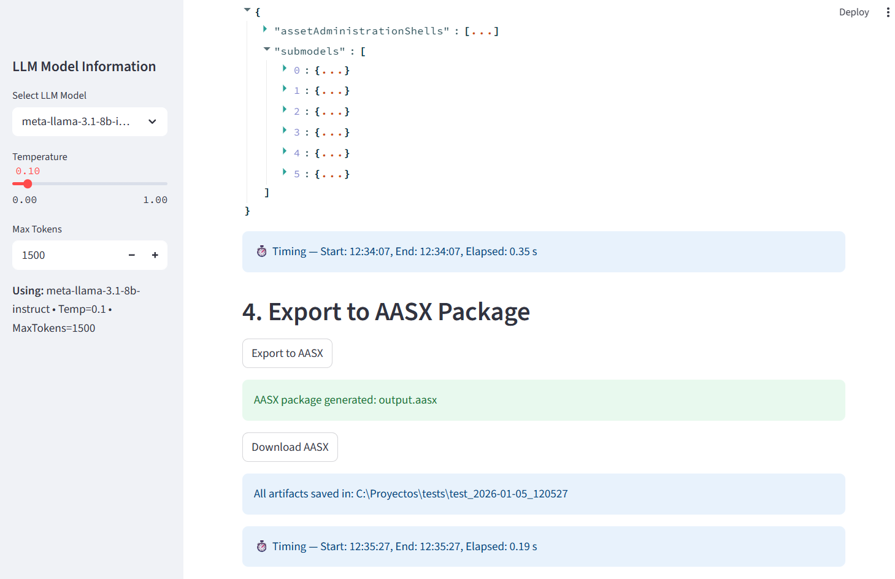

# AASia

AASia is a lightweight no-code framework designed to run locally and operate efficiently in low-resource environments. It enables engineers and domain experts to produce standards-compliant digital representations based on the Asset Administration Shell (AAS) metamodel.

This repository includes a default configuration using a locally deployed instruction-tuned LLM (tested with LM Studio). The LLM backend is abstracted and can be replaced by any compatible local or API-based model.

For security reasons, API credentials for external providers are not included. Users interested in experimenting with API-based LLMs can configure the corresponding adapter by providing their own credentials.

---

## AASia End-to-End Execution Example

This section presents a complete end-to-end execution example illustrating how AASia processes a natural language description and generates a validated Asset Administration Shell, which is then exported and visualized using standard AAS tooling.

---

### 1. Natural Language Input (Text Description)

This screenshot shows the natural language description provided as input to AASia.  
The text describes an automated packaging machine using informal but precise technical language, including nominal values, operating ranges, units, and control system information.

---

### 2. Structured Interpretation

This screenshot presents the structured interpretation generated by AASia from the original text.  
The system identifies relevant entities, groups related attributes, and organizes the information into a hierarchical structure that serves as an intermediate representation for AAS generation.

---

### 3. Generated AAS (JSON)

These screenshots partially show the Asset Administration Shell automatically generated in JSON format.  
The interpreted structure is translated into AAS-compliant elements, including submodels, properties, value types, and qualifiers, following the constraints defined by the AASia generation prompt.

---

### 4. Schema Validation Result

This screenshot displays the result of validating the generated AAS JSON against the AAS meta-model schema.  
The validation confirms that the JSON is well-formed and structurally compliant, ensuring that the generated AAS can be safely used by downstream tools.

---

### 5. AASX Package Generation

This screenshot illustrates the successful export of the generated AAS into an AASX package.  
The AASX file bundles the Asset Administration Shell and its associated submodels into a standardized exchange format.

---

### 6. Visualization in AASX Package Explorer

This screenshot shows the generated AASX package opened in the AASX Package Explorer tool.  
The visualization confirms that the AAS structure, submodels, and properties are correctly recognized and navigable by an external AAS-compliant editor.

---

After completing the execution, the generated AAS was evaluated using the Generic Evaluation Template — AASia.  
The evaluation follows the interpretation and generation constraints defined by the AASia prompts and focuses on coverage of the input description, submodel structure, property representation, data types, range and unit modeling, schema compliance, and execution metrics.

Both the generated artifacts and the corresponding evaluation report are available in the repository under the folder `TestCase-PackMaster3000`.
